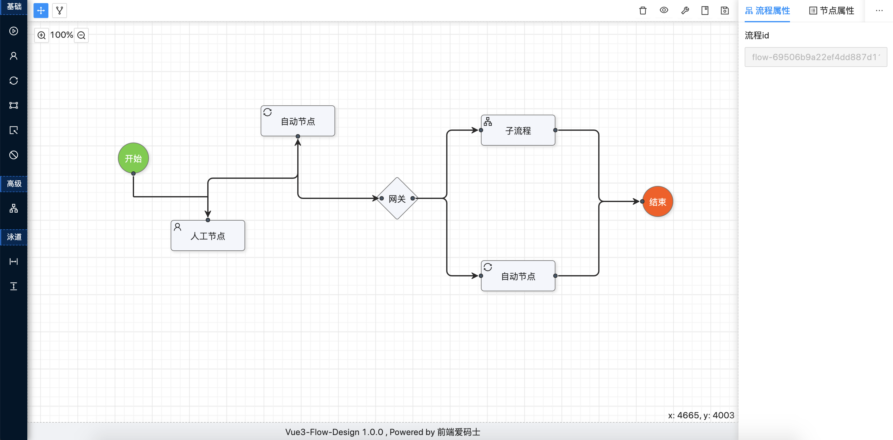

#### 在线演示

[点击预览](http://47.106.144.239:8082/)

#### 介绍

- VUE3 FLOW DESIGN 流程设计器，基于 Vue3 + TypeScript + Vite + Ant Design Vue 3 + JSPlumb，你也可以选择 VUE2 版本[Vue-flow-design-plus](https://gitee.com/zhangyeping/vue-flow-design-plus)。
- Vue3 版本以全新的技术栈重构了代码，并在原版基础上实现了更好的操作方式，新版会作为优先版本持续迭代。

#### 环境版本

- 新的技术栈需要较高的 node 版本，我用的 node: v16.15.1, npm: 8.11.0

#### 技术栈

- VUE3
- TypeScript
- Vite
- Ant Design Vue 3
- JSPlumb
- resizable-dom
- vue3-json-viewer
- ...

#### 操作命令

- 安装项目 node_modules 包：yarn or pnpm

- 启动项目：yarn run dev or pnmp run dev

- 构建项目 dist 文件夹资源：yarn run build or pnpm run build

#### 效果演示

- 最新界面效果 
